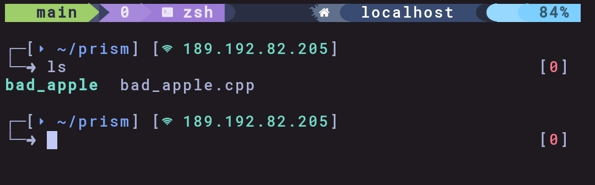

# vulkan-apple

Bad Apple rendered using Vulkan on Termux, running on a Redmi 12 (Snapdragon 685) with the Turnip open-source driver for Adreno 610.





---

## Overview

This project renders the Bad Apple animation using raw Vulkan, without any graphics framework or abstraction layer. Every frame is loaded from disk, uploaded to a staging buffer, and copied directly to the swapchain image via vkCmdCopyBufferToImage. The window is created using Xlib and displayed through Termux:X11.

The project serves as a proof of concept and foundation for Prism, a universal graphics API translation layer targeting Vulkan as its backend.

---

## Technical Details

| Property | Value |
|---|---|
| Device | Xiaomi Redmi 12 |
| SoC | Qualcomm Snapdragon 685 |
| GPU | Adreno 610 |
| Vulkan Driver | Turnip (Mesa 26.0) |
| Vulkan API | 1.0.335 |
| Environment | Termux on Android |
| Display | Termux:X11 via Xlib |
| Resolution | 1280x720 |
| Target FPS | 60 |
| Total Frames | 13,144 |
| Duration | 3:39 |

---

## Pipeline
Bad Apple (WebM) -> ffmpeg frame extraction (PPM) -> staging buffer (host visible)
-> vkCmdCopyBufferToImage -> swapchain image -> VK_PRESENT_MODE_FIFO_KHR -> Termux:X11
No render pass. No pipeline. No shaders. Pure buffer-to-image copy using Vulkan transfer queue.

---

## Requirements

- Termux with Vulkan support
- Turnip driver or any Vulkan-capable GPU driver
- Termux:X11
- libvulkan, libx11, vulkan-headers, shaderc

```bash
pkg install vulkan-headers vulkan-loader-generic libx11 xorgproto shaderc ffmpeg
Build
git clone https://github.com/aguitauwu/vulkan-apple
cd vulkan-apple
clang++ bad_apple.cpp -o bad_apple -lvulkan -lX11 \
  -I$PREFIX/include -L$PREFIX/lib
Usage
Extract frames from the Bad Apple video:
mkdir -p bad_apple_native
ffmpeg -i bad_apple.webm -vf "scale=1280:720,fps=60,format=rgb24" \
  bad_apple_native/frame_%04d.ppm
Run:
export DISPLAY=:1
./bad_apple
Press any key to exit.
Relation to Prism
This project is the renderer prototype for Prism, a universal graphics API translation layer. The goal of Prism is to accept OpenGL, DirectX, Metal, and WebGPU calls and translate them to a common Vulkan backend via an intermediate representation. vulkan-apple validates the Vulkan backend on real mobile hardware under Termux constraints.
License
MIT
